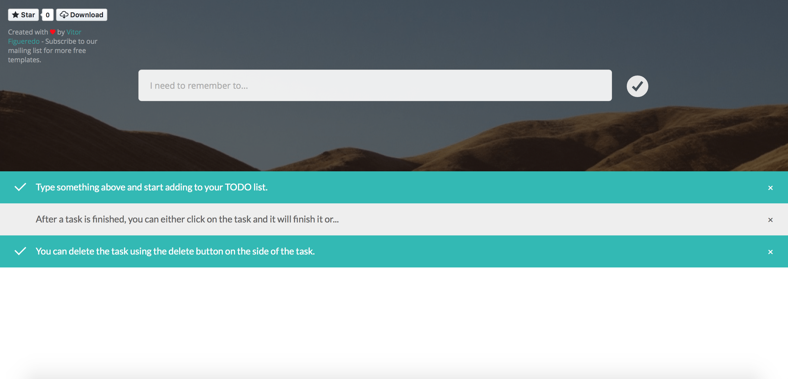

ToDoJS - An Experimental ToDo Website/Tool
-------------

I decided to create this website to test some functions in Javascript ES5. I'm also using this project to test HTML5 and CSS3. If you'd like to continue my work, I was planing on implementing local and/or session storage or, maybe, a nice noSQL database.

If you'd like to help me, you can always **fork** this repository, make your chances and submit a pull request. I'll then evaluate and commit your changes.

Images
------------

Contributing
-------------

1. Fork the repository on Github;
2. Clone the project into your machine;
3. Commit your changes to your own branch;
4. Push your work to your fork;
5. Submit a pull request for review;

Copyright
-------------

This project is under Apache 2.0 license.