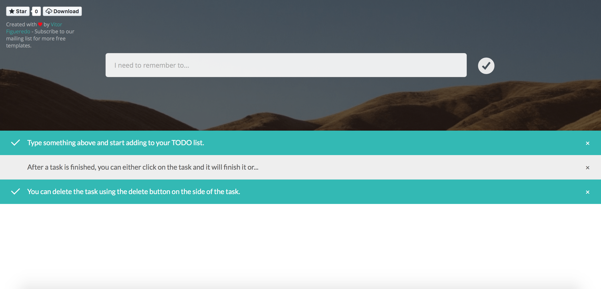

ToDoJS - An Experimental ToDo Website/Tool
-------------

I decided to create this website to test some functions in javascript. It might not be perfect and fully responsive but I'm working on solutions. I'm also using this website to test HTML5, CSS3 and will be using to test MongoDB with PHP.

If you'd like to help me, you can always **fork** this repository, make your chances and submit a pull request. I'll then evaluate and commit your changes.

Images
------------

Contributing
-------------

1. Fork the repository on Github;
2. Clone the project into your machine;
3. Commit your changes to your own branch;
4. Push your work to your fork;
5. Submit a pull request for review;

Copyright
-------------

This project is under Apache 2.0 license.